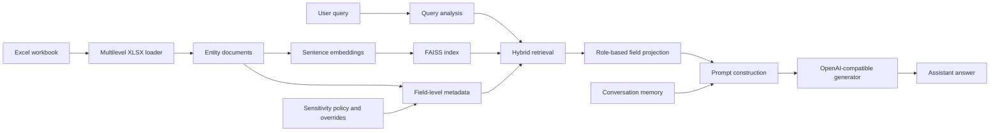

# System Architecture

> **Labelled legacy draft.** The frozen thesis architecture chapter and Appendix F are authoritative. This document is retained only as a development-era description.

This chapter describes the architecture of the implemented field-level, sensitivity-aware Retrieval-Augmented Generation system. The system is designed to answer natural-language questions over a structured spreadsheet-based knowledge base while controlling which individual fields are visible to users with different roles. Access control is modeled at field level rather than only at document or chunk level. A single retrieved entity may contain public, internal, confidential, restricted, and protected fields at the same time. The security boundary is therefore located between retrieval and prompt construction: retrieval may identify a relevant mixed-sensitivity entity, but the prompt given to the language model is built only from the fields that are visible to the active role in secure mode.

The architecture combines spreadsheet ingestion, field-level sensitivity labeling, policy-based role permissions, optional manual sensitivity overrides, dense embedding, FAISS-based retrieval, hybrid lexical and metadata retrieval, relation expansion, field projection, metadata-rich sensitivity-evaluation context construction, prompt construction, OpenAI-compatible answer generation, post-generation leakage verification, and conversation memory. The purpose of this architecture is experimental. It provides a controlled system for evaluating confidentiality risks in field-level, sensitivity-aware RAG over structured spreadsheet data. The evaluation has two main perspectives. The first perspective focuses on the RAG pipeline itself, including retrieval, relation expansion, field-level access filtering, prompt construction, and conversation memory. The second perspective focuses on the language model, examining whether the generator reveals sensitive values, follows access restrictions, or produces unsupported disclosures under different attack scenarios. The post-generation verifier records raw model leakage separately from delivered leakage after final-answer checking. In this way, the architecture makes it possible to distinguish whether leakage originates from the retrieval and context-construction pipeline or from the behavior of the language model during generation.

## 1. Architectural Overview

The system follows the general Retrieval-Augmented Generation pattern. A user query is used to retrieve relevant external knowledge from an indexed corpus, and the retrieved information is inserted into a prompt before a language model generates the final answer. In this implementation, the indexed corpus is derived from the Excel workbook `SiSWiss_Testdaten.xlsx`, which contains the sheets `Rezepte`, `Rezepturen`, `Verfahren`, and `Eigenschaften`. These sheets describe products, formulations, production processes, and product-testing properties.

The system consists of eight main components: a multilevel XLSX ingestion component, a field-level sensitivity policy, an optional override mechanism, an embedding component, a FAISS retrieval index, a hybrid retriever, an access-aware context construction layer, and an OpenAI-compatible generation component. A conversation memory module is used for multi-turn interaction. The high-level pipeline is as follows: the XLSX file is loaded, relational rows are converted into entity documents, structured fields are attached to each entity, sensitivity labels are assigned to each field, document texts are embedded, embeddings are stored in a FAISS index, a user query retrieves relevant entities, the entities are projected according to the active user role, the prompt is constructed from the visible fields, and the language model generates an answer.

This architecture separates semantic relevance from authorization. The retriever is responsible for finding entities that are likely to be useful for answering the question. The field-projection layer is responsible for deciding which values from those entities may be shown to the language model. This distinction is central to the security evaluation because a retrieved entity can be relevant but still contain fields that the active user role is not allowed to see.

## 2. Data Source and Entity Representation

The knowledge base is a structured Excel workbook containing a fictional cosmetic product-development dataset. It represents an enterprise scenario in which information about cosmetic products, their formulations, their production processes, and their quality-control properties is distributed across different organizational roles. The dataset does not contain real company data; instead, it simulates typical business information from a cosmetics manufacturer, such as product names, target markets, formulation identifiers, ingredient lists, suppliers, ingredient percentages, manufacturing steps, testing parameters, and responsible testers.

The use case behind the dataset is that different users should be able to ask questions about the same product knowledge base, but not all users should see the same level of detail. For example, a public or low-privilege user may be allowed to see general product information such as the product name and target market. Internal users may additionally see selected testing properties. Research-oriented users may need more technical formulation or supplier information. Fully privileged users may access the complete recipe and process details, including protected ingredient percentages and manufacturing information. The architecture therefore models a situation in which partial information about fictional cosmetic formulations must be made available to different people without exposing fields outside their access rights.

The workbook contains four relational sheets. The `Rezepturen` sheet contains formulation information such as formulation identifiers, formulation names, categories, descriptions, phases, raw materials, INCI names, suppliers, ingredient percentages, claims, and notes. The `Verfahren` sheet contains manufacturing process identifiers, process names, descriptions, process steps, linked formulation identifiers, and notes. The `Rezepte` sheet contains product identifiers, product names, target markets, linked formulation identifiers, linked process identifiers, and notes. The `Eigenschaften` sheet contains testing properties for products, including parameters, values, methods, dates, and testers.

The ingestion layer does not index the workbook as a single document. It also does not split every cell into an isolated chunk. Instead, it constructs entity-level documents that preserve the relational meaning of the original data. The dataset is transformed into 300 indexed entities: 100 formulation entities, 100 process entities, and 100 product entities.

| Entity type | Source sheet(s) | Count | Main content |
| --- | --- | ---: | --- |
| Formulation | `Rezepturen` | 100 | Formulation identity, phases, ingredients, INCI names, suppliers, percentages, claims |
| Process | `Verfahren` | 100 | Process identity, description, ordered production steps, linked formulation |
| Product | `Rezepte`, `Eigenschaften` | 100 | Product identity, target market, linked formulation and process, testing properties |

Each entity has two representations. The first representation is a textual document used for embedding and retrieval. This text contains a readable summary of the entity, such as a product description, a formulation with its ingredient sections, or a process with its ordered steps. The second representation is structured metadata. The most important metadata field is `entity_fields`, which stores field-level records. Each field record contains a field name, value, sensitivity label, optional category, optional field-specific role restriction, and source information. The source information includes the original sheet name, Excel row index, entity identifier, and source column name.

This dual representation is important for security. The raw entity text can be useful for semantic retrieval, but secure prompt construction does not rely on passing the raw text unchanged to the generator. Instead, secure mode reconstructs the visible context from the structured field list. This makes it possible to remove protected fields from an otherwise relevant entity before the language model sees the prompt.

## 3. Field-Level Sensitivity Policy

The access-control model is defined in `sensitivity_policy.yaml`. The policy defines five ordered sensitivity labels: `public`, `internal`, `confidential`, `restricted`, and `protected`. These labels are associated with ranks from least sensitive to most sensitive. The policy also defines user roles and the labels each role is allowed to access.

| Role | Allowed sensitivity labels |
| --- | --- |
| `public_user` | `public` |
| `internal_user` | `public`, `internal` |
| `research_user` | `public`, `internal`, `confidential`, `restricted` |
| `admin` | `public`, `internal`, `confidential`, `restricted`, `protected` |

The policy also defines role aliases that map concise access names to the corresponding internal role definitions. For example, \texttt{public} resolves to \texttt{public\_user}, \texttt{internal} resolves to \texttt{internal\_user}, and \texttt{protected} resolves to \texttt{admin}. This separates the externally used access terminology from the richer internal role model and keeps the access-control configuration easier to manage.

Sensitivity is assigned at field level rather than at whole-document level. For example, a product entity may contain a public product name, a public target market, internal test values, confidential tester information, and protected linked formulation or process identifiers. Similarly, a formulation entity may contain internal claims, confidential formulation descriptions, restricted ingredient and supplier values, and protected percentage amounts. The entity metadata records the set of sensitivities present in the entity and the maximum sensitivity, but access decisions are made on individual fields.

The policy also defines column mappings. Logical fields such as `product_name`, `target_market`, `ingredient`, `supplier`, `formulation_percentage`, `process_step`, and `tester` are mapped to source Excel column names and assigned default sensitivities and categories. This keeps the security policy outside the Python code and makes it easier to inspect or revise the classification scheme.

## 4. Manual Sensitivity Overrides

The system supports manual review through `sensitivity_overrides.yaml`. Overrides can match a field by sheet name, Excel row index, source column, or logical field name. An override can replace the sensitivity label, category, and allowed roles for a specific field. This mechanism is useful when the default column-level policy is too coarse. For example, most product names may be public, but a specific reviewed product name can be marked as restricted and made visible only to a particular role.

Field-specific `allowed_roles` act as an explicit access-control list. When present, this list overrides the normal label-based role policy for that field. This makes it possible to represent exceptional cases where a field's sensitivity label alone is not precise enough. The tests verify that manual overrides are applied during XLSX ingestion and that overridden fields are projected according to the override rather than the default policy.

## 5. Embedding and Index Construction

After ingestion, each entity text is encoded with the `sentence-transformers/all-MiniLM-L6-v2` embedding model. The resulting dense vectors are normalized and inserted into an in-memory FAISS `IndexFlatIP` index. Because both document vectors and query vectors are normalized, inner-product search corresponds to cosine similarity. This provides a simple and reproducible semantic search backend for the experimental prototype.

The FAISS index stores only vectors, while the retriever keeps the corresponding document texts and metadata in memory. A retrieval result therefore contains the raw entity text and the structured metadata for that entity. The metadata is required for identifier lookup, relation expansion, field projection, access-decision logging, and evaluation. The default retrieval depth is `top_k = 5`, so at most five entities are normally considered for prompt construction after retrieval and expansion.

The embedding index is built at application startup. In the Streamlit interface, shared components such as the loaded dataset, embeddings, FAISS index, retriever, and generator client are cached and reused across chat sessions. Chat-specific state such as memory, focus history, active role, and selected RAG mode remains separate for each session.

## 6. Hybrid Retrieval and Relation Expansion

Retrieval is implemented as a hybrid process. The system supports semantic nearest-neighbor search, lexical term matching, exact metadata lookup, document-type hints, and relation expansion. This is necessary because spreadsheet questions often contain short identifiers such as `P-001`, `R-001`, or `V-001`, and these exact identifiers can be more reliable than semantic similarity alone.

The pipeline first analyzes the user question. It extracts product, formulation, and process identifiers from patterns such as `P-001`, `R-001`, and `V-001`. It also infers document-type hints from words such as "product", "formulation", "ingredient", "process", "steps", "properties", and their German equivalents. If explicit identifiers are found, the retriever first performs metadata lookup for matching entities. If no explicit identifier is available, or if more results are needed, the system falls back to hybrid retrieval.

Hybrid retrieval combines several scores. Semantic similarity is obtained from FAISS. Lexical relevance is computed by tokenizing the query and checking term overlap against a search blob built from the entity text and metadata values. The retriever also gives small boosts to hinted document types, exact identifier mentions, and exact multi-word phrases in product or formulation names. This improves retrieval behavior for structured product data where exact names and identifiers are important.

The pipeline can also expand relations across sheets. A product entity may point to a linked formulation and a linked process. If a user asks about formulation details, process steps, testing properties, or target markets, the pipeline can use metadata identifiers to retrieve the related entity types. This relation-aware retrieval is useful for natural questions that require following links across the workbook. However, relation expansion does not itself authorize the user to see every field in the expanded entities. Authorization is enforced later, during field projection.

The retrieval layer is intentionally separated from visibility enforcement. In the secure architecture, retrieval may return entities that contain restricted or protected fields. This is not automatically a user-visible leak, because the raw retrieved entity is not inserted into the secure prompt. Instead, the retrieved entity is projected into a role-specific visible context before prompt construction. This design allows the system to retrieve useful mixed-sensitivity entities while still removing forbidden field values before generation.

## 7. Secure Context Construction

The system has two RAG modes: `secure_rag_mode` and `sensitivity_eval_mode`. These modes use the same ingestion, embedding, retrieval, and generation components, but they construct context differently.

In `secure_rag_mode`, each retrieved entity is passed through `project_entity_for_user`. This function checks every field in the entity against the active user role. A field is visible if the role is explicitly listed in the field's `allowed_roles`, or, if no field-specific role list exists, if the field's sensitivity label is included in the role's allowed labels. Visible fields are rendered into the context. Forbidden fields are omitted. If an entity has no visible fields for the active role, it is not included in the prompt context.

The output of this projection is a role-specific context chunk. It includes the entity identifier, document type, active role, visible field names, visible values, and source references. It does not include forbidden values. The system also records an access decision containing visible fields, removed fields, and removal reasons. Access logging names the removed fields but does not include the raw removed values by default. This prevents diagnostic logs from becoming an additional sensitive-data channel.

This design means that the primary enforcement boundary in secure mode is not the FAISS search itself. The boundary is the transformation from retrieved entity to visible prompt context. The language model receives only the projected fields. Therefore, if secure mode is configured correctly, a public user can retrieve a mixed product entity internally but the prompt will contain only the public fields of that entity. An internal user can see public and internal fields. A research user can additionally see confidential and restricted fields, but not protected fields. An admin can see all fields.

## 8. Sensitivity Evaluation Mode

The second mode, `sensitivity_eval_mode`, is designed for controlled leakage experiments rather than normal secure operation. In this mode, retrieval does not apply the role sensitivity filter, and the prompt intentionally includes both allowed and restricted facts from retrieved entities. Each field is annotated with metadata-rich sensitivity information, including the sensitivity label, role visibility, allowed roles, source reference, and a disclosure rule for the active role. The context also includes an explicit instruction that restricted facts are present only to test leakage and that the model should answer with allowed facts only.

This mode is useful because it isolates model-level behavior from retrieval-level filtering. If the model receives mixed context with labels, the experiment can evaluate whether it follows access instructions, leaks restricted values, over-refuses allowed information, or fails to answer. The implementation includes helper logic to collect allowed and restricted field values and grade outputs as leakage, correct behavior, over-refusal, or error.

Because `sensitivity_eval_mode` intentionally sends restricted values to the language model, it should not be interpreted as a secure deployment mode. It is an experimental condition. The Streamlit interface exposes both modes and clears chat state when the mode changes so that secure conversations and experimental mixed-context runs remain separated.

## 9. Prompt Construction and Generation

The generation component is implemented through an OpenAI-compatible chat-completion interface. The default configured model is `gpt-4o-mini`, and the same interface can target a local OpenAI-compatible endpoint such as `Qwen/Qwen3-32B` served through vLLM. This allows the same retrieval pipeline, access policy, and evaluation scripts to be used with hosted and locally served model backends. Generation uses temperature `0.0` by default, which improves reproducibility for the experiments.

The generator receives a system message and a final user message built from the current query, retrieved context chunks, optional conversation summary, and optional relevant memory snippets. The prompt instructs the model to use retrieved context as the primary factual source, use conversation memory only for continuity, answer only for explicitly asked or currently active entities, and state clearly when context is missing instead of inventing facts.

The language model does not directly access the Excel workbook, the FAISS index, or the full retrieved metadata. Its view of the data is limited to the prompt constructed by the pipeline. In secure mode, this prompt contains only role-visible projected fields. In sensitivity evaluation mode, it contains mixed labeled context for experimental purposes. This separation makes it possible to classify failures according to the system component involved: retrieval may find sensitive entities, context construction may incorrectly expose fields, memory may carry earlier sensitive values, or generation may reveal restricted values despite instructions.

## 10. Conversation Memory and Focus Tracking

The system includes a conversation memory module for multi-turn interaction. It stores recent user and assistant turns, builds a small FAISS index over memory texts, and maintains a compact conversation summary. Each memory text contains the user's question, the assistant's answer, and retrieved entity identifiers. Later queries can include recent conversation messages, semantically relevant memory snippets, and the summary.

The memory configuration is intentionally bounded. The configured settings keep a recent-turn window of six turns, retrieve up to four relevant memory snippets, and update the summary after batches of four turns. This provides enough state for follow-up questions and multi-turn experiments without introducing a persistent external memory database.

The pipeline also maintains a separate focus history. Explicit product, formulation, and process identifiers are extracted from user questions. The system reuses recent focus identifiers for pronouns and follow-up phrases such as "this product", "the previous one", "it", and similar German references. This improves conversational behavior because users do not need to repeat identifiers in every turn.

Memory and focus tracking are still security-relevant, but not because a normal single-user chat is expected to lose privileges in the middle of a conversation. In a realistic deployment, the access context of one chat session should remain stable. If another user or another role is selected, the safer design is to start a separate session or reset the existing chat. The prototype follows this principle: when the active role or experimental access condition changes, the pipeline clears conversation memory, recent results, visible context, access decisions, and focus history. The access-level downgrade experiment therefore acts mainly as a stress test for session isolation and reset behavior, not as the primary expected user workflow.

## 11. User Interfaces

The prototype provides both a command-line interface and a Streamlit web interface. The command-line interface initializes the data loader, embedding model, retriever, generator, memory module, and pipeline, then enters an interactive query loop. This interface is useful for direct debugging and local inspection.

The Streamlit interface provides multi-chat interaction. Shared components are loaded once and cached, while each chat session receives its own pipeline state. The sidebar allows the user to create new chats, switch between chats, choose the RAG mode, and select the active role. The interface displays the sensitivity labels visible to the selected role. When a mode change or access downgrade occurs, the active chat is cleared and a fresh pipeline is created. This separation is important because the indexed corpus can be shared safely, but memory and access context must remain session-specific.

## 12. Evaluation Support

The architecture is designed primarily to support controlled security experiments, while the chat interfaces provide an interactive way to exercise the same pipeline. Evaluation scripts instantiate the same pipeline under different roles, RAG modes, targets, conversation lengths, and generator backends. The pipeline exposes diagnostic state such as `last_results`, `last_visible_context_chunks`, and `last_access_decisions`, allowing the experiments to inspect both what retrieval found and what was actually made visible to the generator.

This distinction is important for the field-level architecture. A protected value may be present in the raw retrieved entity text or metadata but absent from the secure prompt because field projection removed it. Such a case is different from a prompt-level exposure, where the forbidden value is actually sent to the language model. The evaluation can therefore separate internal retrieval of mixed entities from user-visible context exposure and final-answer leakage.

The same architecture supports the attack scenarios used in the thesis: direct cell extraction, multi-turn row reconstruction, access-level downgrade leakage, relational join-path inference, membership inference, prompt injection through poisoned rows, backdoor-triggered extraction, and embedding-side leakage. Because the implementation records retrieved entities, projected context, memory state, and final answers separately, failures can be attributed to retrieval behavior, context construction, memory persistence, prompt-injection compliance, or generation behavior.

## 13. Security Boundaries and Limitations

The most important security boundary in the system is the field-projection step before prompt construction. In secure mode, the generator should only receive values that are visible to the active role. This is more precise than document-level filtering because it supports mixed-sensitivity entities and avoids discarding an entire product or formulation simply because one field is protected.

However, the design also has limitations. Retrieval still operates over raw entity text and metadata, which may contain fields that are later removed from the prompt. This is acceptable for the local experimental prototype, but it means that internal diagnostics such as raw retrieval results must be handled carefully. Conversation memory is another important boundary. Although memory is cleared on role changes, memory entries themselves are not field-level objects with independent sensitivity labels. A more complete deployment design would make memory sensitivity-aware, separate sessions by access level, and prevent summaries from storing values that cannot be shown under the current role.

The two RAG modes must also be interpreted carefully. `secure_rag_mode` represents the normal enforcement path. `sensitivity_eval_mode` intentionally includes restricted values in the prompt and is used only to test whether the model follows access instructions when exposed to mixed labeled context. Results from these two modes answer different questions: secure mode evaluates whether forbidden values are removed before generation, while evaluation mode measures model behavior when forbidden values are visible but marked as restricted.

## 14. Summary

In summary, the system is a field-level sensitivity-aware RAG architecture over a structured Excel workbook. The ingestion layer converts relational spreadsheet data into 300 entity documents and attaches structured field metadata to each entity. A YAML policy defines sensitivity labels, role permissions, column classifications, aliases, and optional manual overrides. Entity texts are embedded with `sentence-transformers/all-MiniLM-L6-v2` and stored in an in-memory FAISS index. Retrieval combines semantic similarity, lexical scoring, exact identifier lookup, document-type hints, and relation expansion.

A central property of the architecture is that access control is enforced during context construction at field granularity. In secure mode, retrieved entities are projected into role-visible context chunks before the prompt is built, and forbidden field values are omitted. In sensitivity evaluation mode, mixed labeled context is intentionally provided to the model for controlled leakage experiments. Conversation memory and focus tracking support multi-turn dialogue, but memory is cleared when roles change to preserve session isolation. The resulting prototype supports controlled interactive testing and systematic security evaluation of leakage channels in RAG systems over structured enterprise data.
